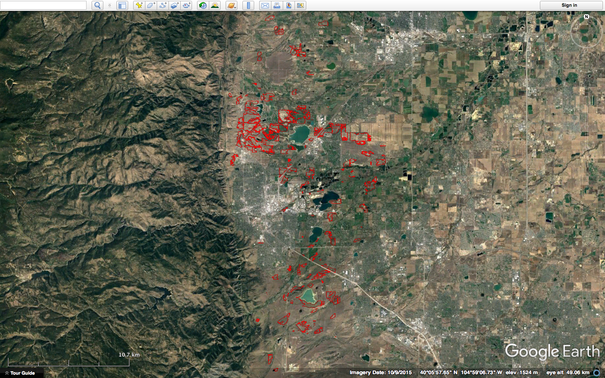
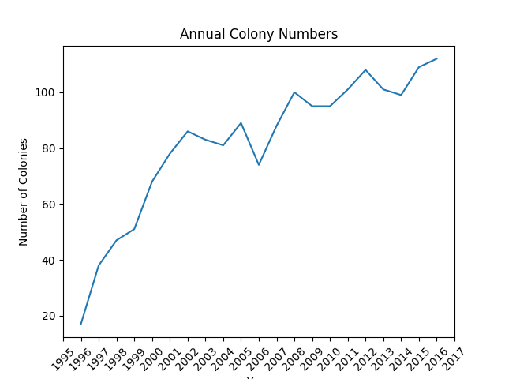
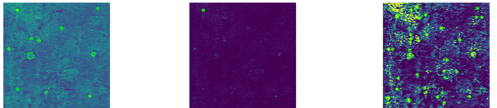
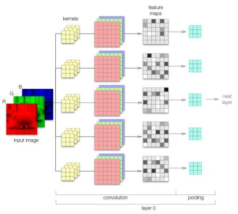

Black-tailed Boundaries
=======================

 Table of contents
 -----------------
1. [Project Motivation](#motivation)
2. [Project Process](#project-process)
3. [Data](#data)
4. [EDA](#eda)
5. [Data Collection](#data-collection)
6. [Image Processing](#image-processing)
7. [Model Selection](#model-selection)

Motivation
----------
 I have always been fascinated by Ecology and biodiversity, so when presented with an opportunity to work with prairie dog data I jumped at the chance. Prairie dogs are a keystone species which play a vital role in maintaining North American grasslands ecosystems. There is clear correlation between their prosperity and high biodiversity. They also provide drastically important ecosystem services, such as groundwater recharge, regulation of soil erosion, soil carbon storage and more[1]. Annually Ecologist with Open Space Mountain Parks (OSMP) map prairie dog colonies within the county of Boulder, measuring the area of each active colony. The goal of this project is to automate the ground mapping and data collection done annually by OSMP. I am hoping this project will benefit Ecologist by eliminating the need to do lengthly ground surveys, saving time to allow for other areas of focus without the loss of important annual data.

 Project Process
 -------
 The final goal of this project is to develop a program that, given aerial photos of a prairie dog colony could predict the area in acreage for that colony. So how did I go about do that? I produced images, processed them, used blob detection to find blobs in these images. Then identified which blobs were prairie dog mounds by developing a CNN classifier. This CNN is then used to label blobs that are mounds. These labeled blobs that are identified as prairie dog mounds are mapped over the area of interest. Once mapped I used shapely to predict the acreage.

Data
----
Each fall Ecologists with OSMP map the measurements of each colony which provides data on the dispersion of the colony. Both the CSV and KMZ files were use to obtain annual colony and spatial data.

The Boulder prairie dog data contains:
- 21 years of data from 1996 to 2016
- 146 different areas as of 2016
- Geospatial data for each of the areas
- Measurements of the perimeter and area for the associated colonies

EDA
---
 The number of colonies tracking by Boulder and OSMP have increase by over 700% since this project began. The Tableau workbook below looks at acreage fluctuation for the different areas since 1996.

[Check out my Tableau workbook here! Boulder Prairie Dog Acreage Over Time](https://public.tableau.com/views/Boulder_prairie_dog_areas/Dashboard1?:embed=y&:display_count=yes&publish=yes)

Data Collection
---------------
In order to identify prairie dog mounds via aerial images.... I need aerial imagery. So I developed a program using Selenium that would scrape Google Earth by navigating to a URL that contained specific coordinates and zoom level. Once a page was fully loaded the program would take a screen shot of the location, this process was repeated as necessary until the whole colony area was traversed.  

Image Processing
----------------
The raw images received were 1440 x 703 pixels, these images were then cropped, removing any edging or unwanted icons. This clean raw image was cropped again to produce square 226 x 226 images so I could visibly identify mounds and so the number of mounds in the image was not overwhelming. Most of this work was done using a handy dandy Python library known as PIL.

<!-- .element height="50%" width="50%" -->

These images were adjusted in order to make the prairie dog mounds more apparent. This was accomplished using gamma correction which transformed the pixel intensities onto a smaller range, compressing them. Next contrast stretching was applied to these values extending the small range of transformed pixel intensities to the full extent of possible pixel intensities. Then Laplace of Gaussian(LoG) blob detection method was used to find the blobs of these adjusted images.

The LoG blob technique detects light on dark areas in an image. This is done with the use of a Gaussian kernel, which gives more weight to the pixels that  line up with the center of the kernel than the edges. The larger the standard deviation of this distribution the more smoothing occurs and visa versa. This blurred image has a Laplace operator applied to it resulting in positive responses for dark areas and negative for bright areas. A large gradient or change from light to dark as is used to determine the presence of a blob. In my this case I use a minimum sigma of 2, max of 10 and a threshold of 0.35. The threshold is telling the model to ignore any local maxima that is lower than 0.35, because remember our domain is between -1 and 1.  

The LoG blob technique returns a central pixel coordinate value for each blob. Using these locations for 20 different images I cropped out 16x16 images and labeled each of these as prairie dog mound or not prairie dog mounds. I decided on the image size by noticing the mound sizes seemed to vary between 5 and 15 pixels. I wanted to encompass as much of the mound as possible without to much background noise.

 <!-- .element height="50%" width="50%" -->

Model Selection
---------------
During the program we learned about two possible methods for image recognition, Multilayer Perceptrons(MLP) and Convolutional Neural Networks(CNN). While MLP is a great supervised learning algorithm, it is also pretty standard. CNN's have been optimized to preform in areas such as image recognition. I chose to tackle an image recognition problem  using a CNN for my project because I felt in practice a majority of industries don't use CNN's and image recognition to solve their business problems.

I trained my CNN on 75% of the 1577(16x16) mound and not-mound images, then tested it on the other 25%. My classes were imbalance 1250:327, non-mound:mound. To solve this problem I stratified my data which is the process of dividing members of this data into homogenous subclass and drawing from them according to ratio as compared to the largest subpopulation.

I designed a base model to compare the performance of my newly designed models with varying hyperparameters, shown below.

|Model Hyperparameter   | Value   |
|-----------------------|---------|
|batch size             |128      |
|number of epochs       |12       |
|number of filters      |32       |
|activation function    |relu     |
|optimizer              |adam     |

|Test Score   |Test Accuracy   | Precision   |Recall   |
|-------------|----------------|-------------|---------|
|0.4901       |0.7897          |0.4878       |0.6250   |

Structure Defines Function
--------------------------

So how do convolutional neural nets work? What is it that allows them to identify objects in an image? Read on to find out.

I need to give you some background on how general neural net(NN) algorithms work. These NN's are fed some input data which is then transformed through a multiple hidden layers composed of neurons. Each neuron is connected to every other neuron in the previous layer but are completely disconnect from the neurons within the same hidden layer, and function autonomously. The final fully connected layer is known as the output layer which contains the results of your regression/classification.

The reason NN's are suboptimal as compared to CNN's when dealing with imagery has to do with these fully connected layers. Each one of these neurons would have a total number of weights equal to the length times the width times the number of bands. Over numerous neurons this many weights will lead to overfitting.

In a CNN the first layer is always a convolutional layer and this layer is traversed by a kernel/filter, which is generally square and much smaller than the image itself. This filter contains weights and as this filter transverses over the image, the forward feed calculations are preformed. This value is the beginning of a feature map, the corresponding value is computed by shifting the filter by defined unit. The process is continued until the whole image has been encompassed and repeated for a defined number of filters. Inner mixed in this is a process call backpropagation where we are trying to minimize our loss function by updating the weights every batch, increasing ones that have more of an impact on decreasing our loss function.   

So what are these filters telling us? Each filter can be thought of as a feature identifier, looking for lines, edges, curves and colors. Each filter has different weights depending on the object it is trying to detect. So if the object is not present the summed value will be low and high if its present, showing us where there is a high likelihood of object being present. Image recognition!

Lets talk about the structure of my optimal CNN on a single image in the hopes of trying to predict if it contains a prairie dog mound or not; the hyperparameters are described in the table below.

|Model Hyperparameter   | Value   |
|-----------------------|---------|
|batch size             |20       |
|number of epochs       |20       |
|number of filters      |250      |
|activation function    |relu     |
|optimizer              |Adamax   |

Convolution begins by taking in a receptive field object that is 16x16x4 which then convoluted by 300 3x3 filters, producing 300 hundred different feature maps of size 14x14x4. The filter weights were initialized using a truncated normal distribution, meaning weights that are more than two standard deviations away from the mean are tossed out then redrawn. These feature maps are then flattened and passed into the activation function RELU(Rectified Linear Unit), this function transforms any negative in the matrix to zero while keeping the rest constant(image with embedded neurons).

I then use a dropout rate of 0.3, which randomly selects neurons to be dropped out at the set rate. This is a form of regularization because the neurons contribution to its downstream connected neighbors is disabled, helping to prevent overfitting.

Last but not least this matrix is applied to a sigmoid function to produce the a vector of labels, 1 for a prairie dog mound and 0 for non-prairie dog mound. I used a threshold of 0.5 to assign the classifications.

My model when through 20 epochs(forward pass and backpropagations) of all of the training samples. One training batch consisted of 20 samples so it took roughly 63 iterations to get through 1 epoch. A gradient descent optimizer called AdaMax was used which is a version of Adam(adaptive moment estimation) that produces adaptive learning rates for each parameter.    

[1] http://journals.plos.org/plosone/article?id=10.1371/journal.pone.0075229
