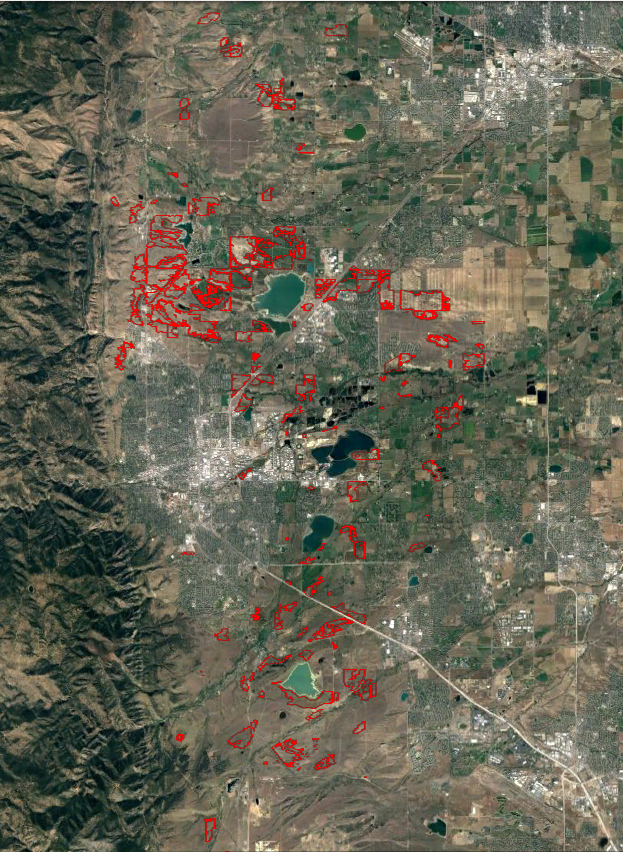

Black-tailed Boundaries
=======================

 Table of contents
 -----------------
1. Project Motivation
2. Project Process
3. Data
4. EDA
5. Data Collection
6. Image Processing
7. Model Selection

Motivation
----------
 I have always been fascinated by Ecology and biodiversity, so when presented with an opportunity to work with prairie dog data I jumped at the chance. Prairie dogs are a keystone species which play a vital role in maintaining North American grasslands ecosystems and there is clear correlation between their prosperity and biodiversity. They also provide drastically important ecosystem services, such as groundwater recharge, regulation of soil erosion, soil carbon storage and more[1]. Annually Ecologist with Open Space Mountain Parks (OSMP) map prairie dog colonies within the county of Boulder, measuring the area and perimeter of each active colony. The goal of this project is to automate the ground mapping and data collection done annually by OSMP. I am hoping this project will benefit Ecologist by eliminating the need to do lengthly ground surveys, saving time to allow for other areas of focus without the loss of important annual data.

 Project Process
 -------
 The final goal of this project is to develop a program that, given aerial photos of a prairie dog colony could predict the area and perimeter for that colony. So how did I go about do that? I produced images, broke them down, used blob detection to find blobs in these images. Then identified which blobs were prairie dog mounds using a CNN classifier. This CNN is then used to label blobs that are mounds. These labeled blobs are then used to train a final CNN to predict which pixels are mounds in new images. Once the mounds are identified I can use shapely(or other method) to predict the area

Data
----
Each fall Ecologists with Open Space Mountain Parks map the perimeter of each colony which provides data on the extent of the colony. Both the CSV and KMZ files were use to obtain annual colony and spatial data.

The Boulder prairie dog data contains:
- 21 years of data from 1996 to 2016
- 146 different areas as of 2016
- Geospatial data for each of the areas
- Measurements of the perimeter and area for the associated colonies

EDA
---
 The number of colonies tracking by Boulder and OSMP have increase by over 700% since this project began. If I have enough time I would like to look at area/perimeter fluctuation over the 21 years.

Data Collection
---------------
In order to identify prairie dog mounds via aerial images.... I need aerial imagery. So I developed a program using Selenium that would scrape Google Earth by navigating to a URL that contained specific coordinates and zoom level. Once a page was fully loaded the program would take a screen shot of the location, this process was repeated as necessary until the whole colony area was traversed.  

[Check out my Tableau workbook here! Boulder Prairie Dog Acreage Over Time](https://public.tableau.com/views/Boulder_prairie_dog_areas/Dashboard1?:embed=y&:display_count=yes)

Image Processing
----------------
The raw images received were 1440 x 703 pixels, these images were then cropped, removing any edging or unwanted icons, then cropped again to produce square 226 x 226 images. #(add, why these are square) Most of this work was done using a handy dandy Python package known as PIL(Python Image Library).

These images were adjusted in order to make the prairie dog mounds more apparent. This was accomplished using gamma correction to brighten the image, making the pixel distribution smaller then stretching these values to the full extent of the pixel intensity range via contrast stretching. Then LoG blob detection method was used to find the blobs of these adjusted images.

The LoG blob technique returned a central pixel coordinate value for each blob. Using these locations I cropped out 16x16 images and labeled each of these images as prairie dog mound or not prairie dog mounds. I decided on the image size by noticing the mound sizes seemed to vary between 5 and 15 pixels. I wanted to encompass as much of the mound as possible without to much background noise.

Model Selection
---------------
Base model for mound classification:
batch_size = 128
nb_epochs = 12
nb_filters = 32
activation func = relu
optimizer = Adadelta

Test score: 0.490175707065
Test accuracy: 0.789743589744

[1] http://journals.plos.org/plosone/article?id=10.1371/journal.pone.0075229
