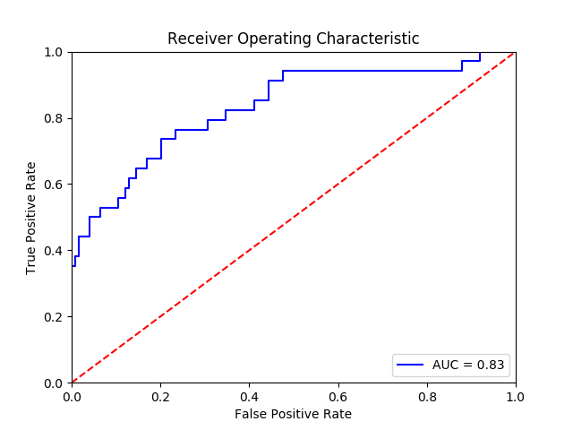

Black-tailed Boundaries
=======================

 Table of contents
 -----------------
1. [Project Motivation](#motivation)
2. [Project Process](#project-process)
3. [Data](#data)
4. [EDA](#eda)
5. [Data Collection](#data-collection)
6. [Image Processing](#image-processing)
7. [Model Selection](#model-selection)
8. [My CNN](#my-cnn)
9. [Model Results](#model-results)
10. [Mapping & Predicting Acreage](#mapping-predicting-acreage)
11. [My Results](#my-results)
12. [Next Steps](#next-steps)

Motivation
----------
 I have always been fascinated by ecology and biodiversity, so when presented with an opportunity to work with prairie dog data I jumped at the chance. Prairie dogs are a keystone species which play a vital role in maintaining North American grasslands ecosystems. There is positive correlation between their prosperity and high biodiversity. They also provide vital important ecosystem services, such as groundwater recharge, regulation of soil erosion, soil carbon storage and more[1]. Annually ecologists with Open Space Mountain Parks (OSMP) map prairie dog colonies within the county of Boulder, measuring the area of each active colony. The goal of this project is to automate the ground mapping and data collection done by OSMP. I am hoping this project will benefit ecologists by eliminating the need to do lengthly ground surveys, therefor saving time to allow for other areas of focus without the loss of important data.

 Project Process
 -------
 The final goal of this project is to develop a program that given aerial photos of a prairie dog colony could predict the area in acreage for that colony. So how did I go about doing that? I produced images, processed them, and used blob detection to find blobs in these images. I then identified which blobs were prairie dog mounds by developing a CNN classifier. This CNN is then used to label blobs that are mounds. These labeled blobs that are identified as prairie dog mounds are mapped over the area of interest. Once mapped I used shapely to predict the acreage.

Data
----
Each fall ecologists with OSMP map the measurements of each colony which provides data on the dispersion of the colony. Both the CSV and KMZ files were use to obtain annual colony and spatial data.

The Boulder prairie dog data contains:
- 21 years of data from 1996 to 2016
- 146 different areas as of 2016
- Geospatial data for each of the areas
- Measurements of the perimeter and area for the associated colonies

EDA
---
 The number of colonies tracked by Boulder and OSMP have increased by over 700% since this project began. My Tableau workbook below looks at acreage fluctuations for the different areas since 1996.

[Check out my Tableau workbook here! Boulder Prairie Dog Acreage Over Time](https://public.tableau.com/views/Boulder_prairie_dog_areas/Dashboard1?:embed=y&:display_count=yes&publish=yes)

Data Collection
---------------
In order to identify prairie dog mounds, I needed aerial imagery. I developed a program using Selenium that would scrape Google Earth by navigating to a URL that contained specific coordinates and zoom level. Once a page was fully loaded the program would take a screen shot of the location. This process was repeated as necessary until the whole colony area was traversed.  

Image Processing
----------------
The raw images received were 1440 x 703 pixels. These images were then cropped to remove any edging or unwanted icons. This clean raw image was cropped again to produce square 226 x 226 images. This allowed for the mounds to be visibly identifiable and not numerically overwhelming. Most of this work was done using Python library known as PIL.

These images were adjusted in order to make the prairie dog mounds more apparent. This was accomplished using gamma correction which transformed the pixel intensities by compressing them into a smaller range. Next contrast stretching was applied to these values extending the small range of transformed pixel intensities to the full extent of possible pixel intensities. Then, Laplace of Gaussian(LoG) blob detection was used to find the blobs in these adjusted images.

The LoG blob technique detects light on dark areas in an image. This is done with the use of a Gaussian kernel, which gives more weight to the pixels that line up with the center of the kernel than it does the edges. The larger the standard deviation of this distribution the more smoothing occurs and visa versa. This blurred image has a Laplace operator applied to it resulting in positive responses for dark areas and negative for bright areas. A large gradient or change from light to dark is used to determine the presence of a blob. In this case I use a minimum sigma of 2, max of 10 and a threshold of 0.35. The threshold is telling the model to ignore any local maxima that is lower than 0.35, because remember our domain is between -1 and 1.  

The LoG blob technique returns a central pixel coordinate value for each blob. Using these locations for 20 different images I cropped out 16x16 images and labeled each of these as prairie dog mound or unknown object. I decided on the image size by noticing the mound sizes seemed to vary between 5 and 15 pixels. I wanted to encompass as much of the mound as possible without too much background interference.

Model Selection
---------------
We learned about two possible methods for image recognition, Multilayer Perceptrons(MLP) and Convolutional Neural Networks(CNN). While MLP is a great supervised learning algorithm, it is also pretty standard. CNN's have been optimized to perform in areas such as image recognition. I chose to tackle an image recognition problem using a CNN because it seemed like the only reasonable option to accomplish my goal. Also in practice a majority of industries do not not use CNN's and image recognition to solve their business problems, so I felt it was a good opportunity to showcase a different method.

The amount of prairie dog mound photos as compared to unknown object photos was unbalanced so I stratified the images. This process divides members of the data into homogenous subclasses and draws from them according to a ratio as compared to the largest subpopulation.

I designed a model that produced a high level of precision to make sure my model was only identifying prairie dog mounds. Using a grid search and varying the models hyperparameters I was able to find several optimal models. In order to evaluate the performance of my models in an unbiased manner I split the data into a train, test(10%) and validation set. To compare how they would preform on unseen data I used 5-KFold cross validation and averaged my statistic of interest using the training and validations sets.

The optimal model I found hyperparameters are shown below.

|Model Hyperparameter   | Value   |
|-----------------------|---------|
|batch size             |10       |
|number of epochs       |75       |
|number of filters      |5        |
|activation function    |RELU     |
|optimizer              |AdaMax   |

My Model
---------

Lets talk about the structure of my optimal CNN. The hyperparameters used were described in the table above.

Convolution begins by taking in the receptive field object that is 16x16x4 which is then convoluted by 5, 3x3 filters, producing 5 different feature maps of size 14x14x5. The filter weights were initialized using a truncated normal distribution, meaning weights are greater toward the center. If a drawn wight is more than two standard deviations away from the mean it is tossed out and redrawn.

This forward process uses the activation function, RELU(Rectified Linear Unit). RELU transforms any negative value in the matrix to zero while keeping the rest constant(image with embedded neurons). These feature maps are convoluted again using the same size filter and activation function to produce 5, 12x12 new feature maps. Afterwards the dimensional object is downsampled using maxpooling. A 2x2 filter is applied to the input volume and extracts the maximum value from inside the filter. The filter then shifts the dimension of the filter until the whole volume is covered. The downsampling process reduces the spatial size and the number of parameters, which decreases the possibility of overfitting. This downsampling produces a value of images of size 5x6x6.

I then use a dropout rate of 0.3, which randomly selects neurons to be dropped out at the set rate. This is a form of regularization, only 70% of the neurons contribution to their downstream connected neighbors and the overall error. This means that only 70% of errors will be backpropagated through the network. All of these consequences do to the dropout layer helping to prevent overfitting.

Lastly this matrix is applied to a sigmoid function to produce the a vector of labels, one for a prairie dog mound and zero for an unknown object. I used a threshold of 0.5 to assign these classifications.

My model went through 75 epochs(forward pass and backpropagations) of all of the training samples. One training batch consisted of 10 samples so it took roughly 157 iterations to get through one epoch. A gradient descent optimizer called AdaMax was used which is a version of Adam(adaptive moment estimation) that produces adaptive learning rates for each parameter.  

Model Results
----------
When I tested my model on the holdout set the times it predicted a prairie dog mound, it was correct 77% of the time. Out of all of the identifiable prairie dog mounds my model identified 60% of them. I am not 100% satisfied with this result because the objective of my CNN was to filter blobs that had been identified as prairie dog mound when they where clearly unknown objects, there are some items to address in order to improve my precision.

|Test Score   |Test Accuracy   | Precision   |Recall   |F1 Score   |
|-------------|----------------|-------------|---------|-----------|
|0.3979       |0.8607          |0.7727       |0.6071   |0.6071     |

To see how well my binary classifier was preforming I developed a Receiver Operator Characteristic curve(ROC). The curve shows the true positive rate vs. the false positive rate for all possible thresholds. The AUC of my model is 0.83 which tells you the probability the classifier will rank a randomly chosen positive observation higher than a randomly chosen negative observation.

Mapping & Predicting Acreage
----------------------------
Using the known prairie dog mounds, I was able to map their locations over the area and create a polygon object using Shapely. My polygon initially was very geometric in its shape. I needed to find a way to make the polygon shape more dynamic and complex to obtain a better area calculation. I found a great tutorial from Kevin Dwyer[2] on how to do this, below is the conceptual overview of how this was accomplished.

First I created Delaunay triangles which creates my polygon out planer triangles, with no point inside any triangle perimeter. This process maximizes the minimum angle of all the triangles in the triangulation. Then using these triangle points I calculate the circumference for each triangle. Triangles that are too far from their neighbors are removed using a specific circumference as a threshold. After removing these triangles I was still left with an object that has edge points in the middle of the area. I removed these inner edges to create my polygon object.

My Results
----------
Using the polygon object from the previous section I was able to calculate the area in pixels squared. Through unit conversion I calculated the acres for the Jafay prairie dog colony.

|Predicted Acreage   |Test Acreage   |
|--------------------|---------------|
| 466.7              |261.8          |

Next Steps
----------
My image shifts are slightly off and could be playing a large part in the acreage difference, I will make sure these shifts are exact and determine how this improves my calculated acreage. Currently I am using a single CNN. I want to develop a deeper CNN in an attempt to improve my prairie dog mound classifier. I could also see some improvement in the classifier if I label more images and retrain my model. The last item I would like to develop is a class. Developing a class would allow me to create an instance for multiple prairie dog areas and provide functionality to predict the acreage for each one.  

Thank you for reading!

Resources:

[1] http://journals.plos.org/plosone/article?id=10.1371/journal.pone.0075229

[2] http://blog.thehumangeo.com/2014/05/12/drawing-boundaries-in-python/
